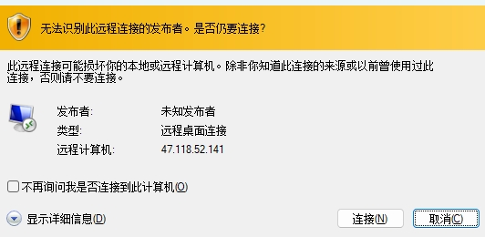
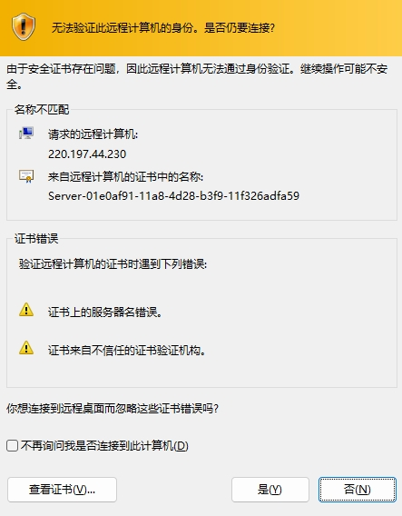
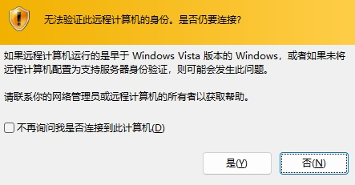
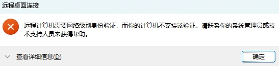
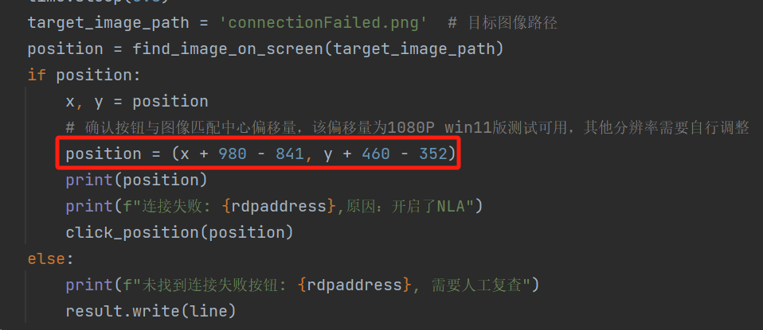

# RDP-NLA-Closing-Scanner

Used for batch scanning whether Remote Desktop has NLA (Network Level Authentication) disabled, and subsequent semi-automatic searching for Sogou Input Method RCE.

Based on testing, solutions that do not use `mstsc.exe` cannot deterministically determine whether NLA is enabled. Although this tool uses image matching and is slightly less efficient, its accuracy rate is very high.

## Usage

1. Install dependencies via python.
2. Enter the RDP connection addresses in `RDPList.txt`, one per line. Three formats are supported:

```
Domain:port
ip:port
ip (Default Port 3389)
```

3. Modify screen captures and coordinate offsets (the defaults are captures and confirmation coordinates for a Win11 1080p screen).









A total of 7 coordinate offsets need to be modified. The current logic is: the `find_image_on_screen` function matches the image to find the center point on the current screen. By calculating the offset between the confirmation button and the center point, it ensures the option is clicked every time:



## Demo Video

[](http://abc666.2.996h.cn/showvedio.mp4)

## Principle

The tool directly calls the system RDP client and attempts to connect to a remote server using a configuration file that disables NLA. If the remote server has NLA enabled, it will prompt that the connection failed (as shown below). By capturing the screen using the CV library and performing image matching, it uses `pyauto` to automatically click the confirmation button. Simultaneously, it uses CV screen capture and image matching to judge the reason for the connection failure and saves the results to `result.txt`.


## Disclaimer

This tool is intended only for legal and authorized corporate security construction activities. If you need to test the usability of this tool, please set up your own target environment.

To avoid malicious use, all PoCs included in this project are theoretical judgments of vulnerabilities; there is no exploitation process, and no actual attacks or vulnerability exploitations will be launched against the target.

When using this tool for detection, you should ensure that the behavior complies with local laws and regulations and that you have obtained sufficient authorization. Do not scan unauthorized targets.

If any illegal behavior occurs during your use of this tool, you shall bear the corresponding consequences yourself; we will not assume any legal or joint liability.

Before installing and using this tool, please be sure to carefully read and fully understand the contents of each clause. Restrictions, disclaimer clauses, or other terms involving your significant rights and interests may be highlighted with bold or underlined text for your attention. Unless you have fully read, completely understood, and accepted all terms of this agreement, please do not install or use this tool. Your act of using the tool or expressing acceptance of this agreement in any other explicit or implicit manner shall be deemed as having read and agreed to be bound by this agreement.
